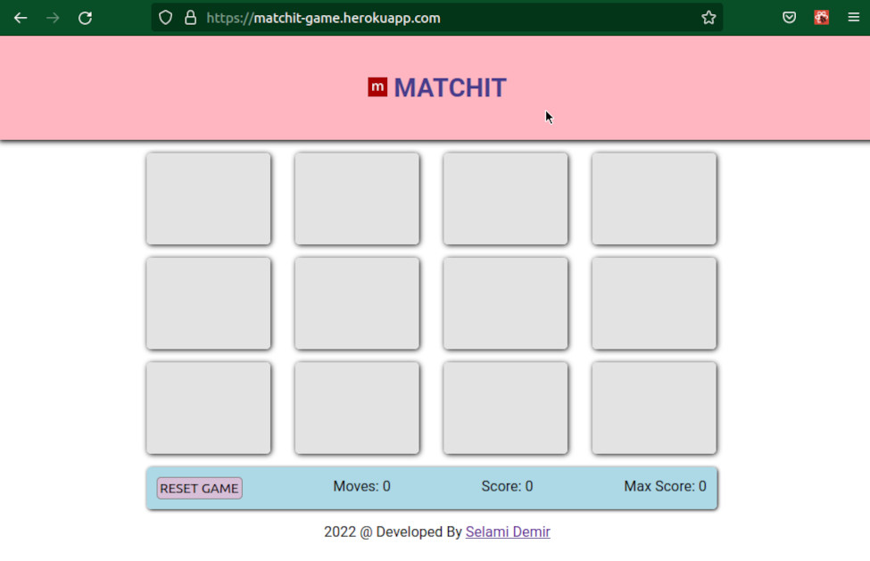
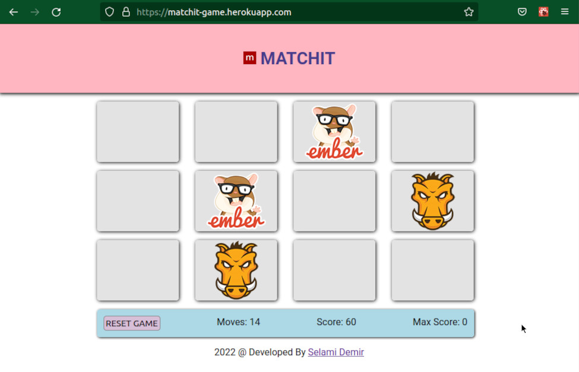
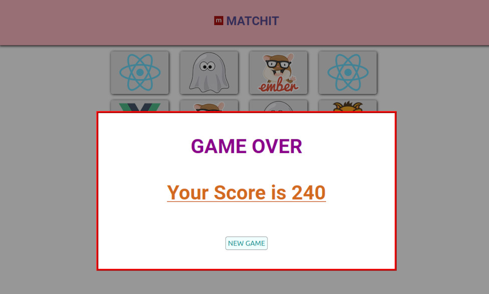

# Matchit - Taş eşleştirme oyunu

React Js ile geliştirilmiş bir taş eşleştirme oyunu.

## Demo

Matchit oyununu hemen oynamak için [tıklayınız](https://matchit-game.herokuapp.com/ "Matchit Game").

## Kullanılan Teknolojiler

Matchit oyununu geliştirirken 

1- React JS.
2- React Context API.
3- CSS.
4- Nanoid kütüphanesi.

kullanıldı. Nano id item oluştururken **ID** değeri için kullanıldı. Kullanılmasa ve yerine itemler oluşturulurken kullanıdığımız **map** metodunun bize verdiği index değeri de kullanılabilirdi.

## Oyunun Oynanışı

Oyun 12 adet karttan oluşuyor. Toplam 6 şekil ve her şekilden 2 adet bulunuyor. Oyundaki amaç en az hareketle eşleşen taşları bulmak. Her bulunan taş 50 puan kazandırıyor. Eşleşmeyen her harekete ise 10 puan kaybettiriyor.

## Ekran Görüntüleri

